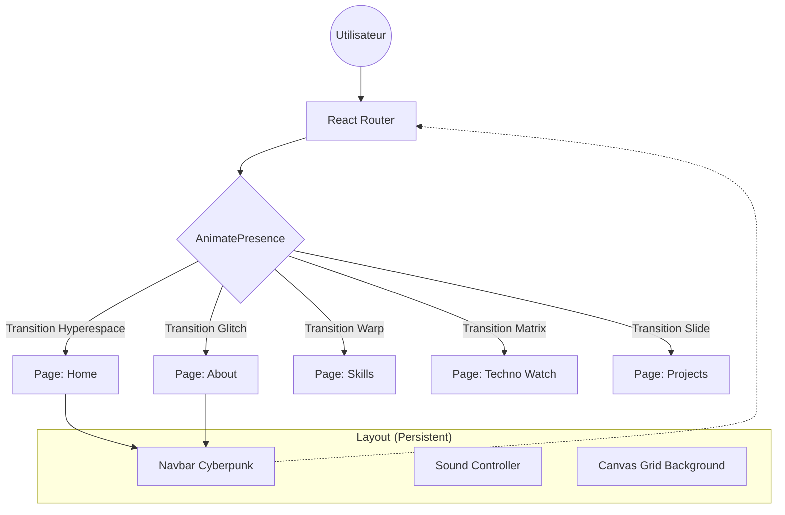

# 🏗️ ARCHITECTURE TECHNIQUE — PortfolioV2

> **Phase BMAD :** A (Architect)
> **Statut :** VALIDATED (En attente de validation)
> **Date :** 2026-02-11

---

## 1. Stack Technique

### 1.1 Cœur & Build
*   **Runtime**: Node.js (LTS v22+)
*   **Framework**: **React 19**
*   **Bundler**: **Vite 6** (Rapidité, HMR instantané, plugin ecosystem riche)
*   **Langage**: **TypeScript 5.7+** (Incontournable pour la robustesse et l'autocomplétion)

### 1.2 Routing & Navigation
*   **Router**: **React Router v7**
    *   *Rationale*: Standard de l'industrie, permet de gérer le routing côté client (SPA) nécessaire pour les "transitions immersives" demandées tout en gardant une structure d'URL propre.
    *   *Mode*: `createBrowserRouter` (Data APIs pour loaders/actions si besoin).

### 1.3 Styles & UI
*   **Préprocesseur**: **SCSS (Sass)** avec **CSS Modules**.
    *   *Rationale*: Isolation des styles (pas de fuite globale), puissance du nesting et des mixins, tout en restant proche du standard CSS. Respecte la demande d'éviter Tailwind ("Rich Aesthetics" demandée, SCSS offre un contrôle précis).
*   **Design Tokens**: Variables CSS natives (`:root`) pour le theming dynamique (Cyberpunk colors).
*   **Typographie**: Fontsource (Google Fonts self-hosted) pour *Orbitron* et *Montserrat*.
*   **Iconographie**: `lucide-react` ou `react-icons` (légèreté).

### 1.4 Animations (Cœur de l'expérience)
*   **Moteur Principal**: **Framer Motion** (v11+).
    *   *Rationale*: La meilleure librairie pour gérer les `exit animations` (AnimatePresence) indispensables pour les transitions de pages "voyage".
*   **Particules/Effets**:
    *   Canva natif (via `refs` React) pour la grille perspective légère.
    *   Optionnel: `@react-three/fiber` si 3D complexe requise (mais attention performance). On privilégiera CSS/Canvas 2D pour l'instant.

### 1.5 Qualité & Tooling
*   **Linter**: ESLint (config `flat` recommandée) + Prettier.
*   **Tests**: **Vitest** (Unit) + **Testing Library** (Composants).
*   **Hooks**: `usehooks-ts` (collection standard).

---

## 2. Architecture des Dossiers (src/)

Organisation **Feature-First** hybride avec séparation claire UI/Logique.

```text
src/
├── assets/             # Images, fonts, SVG (statiques importés)
├── components/         # Composants UI partagés (Atomic Design simplifié)
│   ├── atoms/          # Boutons, Inputs, Typo (base indivisible)
│   ├── molecules/      # Cards, NavItems (assemblages simples)
│   ├── organisms/      # Navbar, Footer, HeroSection (complexe)
│   └── templates/      # Layouts structurels (MainLayout, AuthLayout)
├── context/            # Global State (ThemeContext, SoundContext) - Minimal
├── data/               # Données statiques JSON/TS (Contenu Portfolio)
├── hooks/              # Custom hooks réutilisables (useScroll, useWindowSize)
├── pages/              # Vues complètes (Home, About, Skills...)
│   ├── Home/
│   │   ├── HomePage.tsx
│   │   ├── Home.module.scss
│   │   └── components/ # Composants spécifiques à Home
├── styles/             # Styles globaux, mixins, variables
│   ├── _variables.scss
│   ├── _mixins.scss
│   └── main.scss       # Entry point
├── types/              # Définitions TypeScript globales (Models)
├── utils/              # Fonctions pures helper
├── App.tsx             # Root component + Routing setup
└── main.tsx            # Entry point Vite
```

---

## 3. Patterns & Règles Clés

### 3.1 "Voyage" entre les pages (Transitions)
L'application agira comme une **SPA (Single Page Application)**.
Pour simuler le voyage :
1.  `<AnimatePresence mode="wait">` enveloppera les routes.
2.  Chaque page (`<motion.div>`) définira ses variantes `initial`, `animate`, `exit`.
3.  **Performance Check**: Utiliser `will-change: transform` sur les éléments animés lourds.

### 3.2 Gestion des Données
Le contenu texte (About, Skills, History) sera stocké dans `src/data/content.ts` (ou JSON) pour respecter le principe du Blueprint (verbatim).
*   Pas de CMS headless pour l'instant (KISS).
*   Typage strict via `MODELS.ts`.

### 3.3 Accessibilité (a11y)
*   **`prefers-reduced-motion`**: Utilisation du hook `useReducedMotion` de Framer Motion pour désactiver les effets violents de voyage si nécessaire.
*   **Navigation Clavier**: Focus trap dans les modales, `skip-links` implémentés.
*   **Semantic HTML**: Header, Main, Footer, Nav, Section, Article obligatoires.

---

## 4. Stratégie de Migration

1.  **Phase Initiale**: Créer un nouveau projet Vite dans le dossier racine (après backup legacy).
2.  **Assets**: Déplacer images/fonts vers `public/` ou `src/assets/`.
3.  **Contenu**: Copier le texte de `index.html` et autres vers `src/data/`.
4.  **Composants**: Recréer les effets (Fly-in text, Orbit) en React + Framer Motion.
    *   *Note*: Réécrire le JS jQuery/Vanilla en React (useEffect/useRef).

---

## 5. Diagramme de Flux (Navigation)


